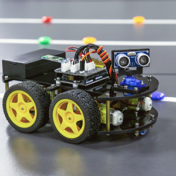
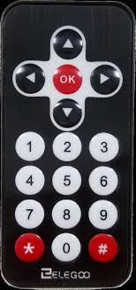

# Arduino Smart Car

## Brief Overview
The smart car application implements line tracking, obstacle avoidance, and manual drive control functionalities using infrared and ultrasonic sensors to drive the cars motors. The hardware used in this project comes from the Elegoo Smart Robot Car Kit 3.0 Plus and was purchased from them. The software written on the arduino to control the components and it's peripherals is custom written software by me. I take no credit for the hardware used in this project.  

## Operation 
When the smart car is powered on the car will sit and wait for a drive mode to be selected. The infrared remote is used to switch the smart robot into one of three modes, line tracking, obstacle avoidance, and manual driving. Button "1" puts the car into manual drive, button "2" is obstacle avoidance, and button "3" line tracking. The code also provides the setup and functions to utilize the servo motor, but were not used in this implementation. 

### Manual Drive
Manual drive provides the functionality to pilot the car using 5 keys to propel the car. The forward and back arrows drive the car forward and backwards and then the left and right arrows turn the car left and right respectively while the "OK" button is used to stop the car. Manual drive requires the use of an infrared sensor to receive the input from the infrared remote. The binary codes received from the remote are processed and then activate the motor control. When the car is switched into any other mode the car will initially stop and then begin carrying out its drive mode. 

### Obstacle Avoidance
The obstacle avoidance capabilities are limited but perform consistently. When the car gets within 35 centimeters of an object it should turn around about 150 degrees and continue in the forward direction. The cars ability to detect objects significantly drops when the obstacle is located at more of an angle in front of the car instead of perpendicular. The obstacle avoidance functionality utilizes the feedback from an ultrasonic sensor to calculate how far away an object is using the speed of sound/sound waves. 

### Line Tracking
When the smart car is placed on a solid surface in front of a circuit based track with white paper the car can successfully navigate the track and run laps in both directions on the track. The line tracking capability uses a 3-in-1 IR sensor module. Each IR sensor has a light emitting diode (LED) and a receiver. When an object comes close the light reflects off the object and is detected by the receiver. A potentiometer on the 3-in-1 IR module is used to reduce the sensitivity of the sensors to prevent unwanted noise and detecting the floor from being in such close proximity. White tape is used because the light is reflected the best over say red, blue, or black tape where the light gets absorbed instead of reflected. When the middle sensor provides a digital high the car moves forward, when the left sensor gives a digital high the car moves right and vice versa applies for the right sensor.  

### Improvements
The performance of the smart car could be enhanced by using one directional rangefinders, 360 degree lidar, depth sensing cameras, or additional ultrasonic sensors. The 360 degree lidar would provide the best improvement as the smart car would be used for inside environments and the 360 degree object proximity reading would provide the great feedback for mapping out home environments due to visibility in all directions. 

## Videos
- Smart car overview: https://youtu.be/IYsviR8NkQU
- Obstacle avoidance and manual drive functionalities demonstrated: https://youtu.be/zaS6iFsqof8
- Line tracking: https://youtu.be/unu8nYK1Nvs
